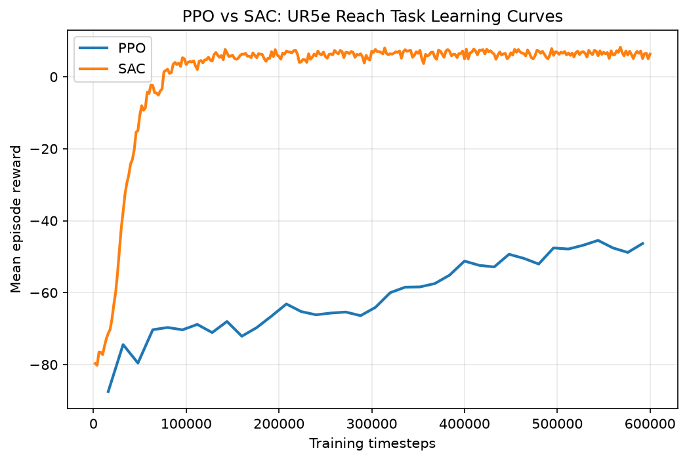
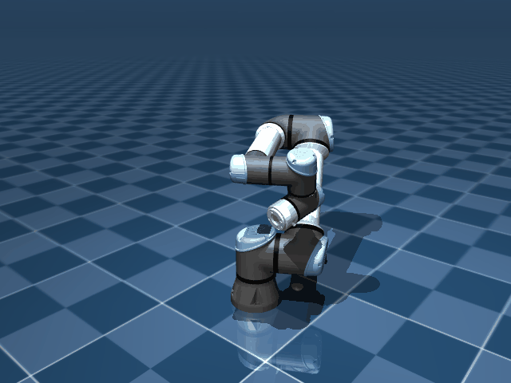

# UR5e Reach: MuJoCo RL Policy Deployed via ROS 2

A UR5e arm learns to reach randomly placed 3D targets in MuJoCo via reinforcement learning, then gets deployed through a ROS 2 node interface — the same topic structure a real robot controller would use, not just a script that happens to move a simulated arm.

I built this to compare PPO against SAC on a continuous control task, and to get past the part most RL tutorials stop short of: taking a trained policy out of a script and wiring it into something that actually looks like a robotics stack.

## Why a reach task, not full grasping

Full grasping (arm plus gripper contact dynamics) was the obvious next step after doing navigation work, but contact-rich reward shaping is notoriously slow to get right — it can eat weeks before anything trains reliably. A pure reach task skips the contact problem while still exercising the whole pipeline: environment design, training, and ROS 2 deployment.

I used the official [MuJoCo Menagerie](https://github.com/google-deepmind/mujoco_menagerie) UR5e model instead of building a URDF from scratch. No reason to reinvent a robot model DeepMind already maintains and validates.

## Repo structure

```
envs/reach_env.py                 - Gymnasium environment wrapping MuJoCo UR5e
training/train_ppo.py             - PPO training with logging
training/train_sac.py             - SAC training with logging
training/compare_results.py       - learning curve plots + head-to-head evaluation
record_demo.py                    - records a GIF of the trained policy in action
models/mujoco_menagerie/          - UR5e MuJoCo model (official, git-cloned, not vendored)
ros2_ws/src/mujoco_arm_bridge/    - ROS 2 package: sim_node + policy_node
results/                          - training outputs land here (gitignored except plots/gif)
```

## Design decisions worth reading

**Actions are normalized joint deltas, not absolute angles.** I tried absolute joint positions first and the policy barely progressed — it had to learn the entire joint range from scratch on every dimension. Small per-step deltas in `[-1, 1]` turn the problem into "which direction do I nudge" instead of "where exactly do I need to be." Converges much faster.

**Reward combines dense distance with a sparse success bonus.** Sparse-only reward gives almost no signal early on, since a random policy essentially never succeeds by chance. Dense-only reward can leave a policy hovering just outside the threshold, because the last few centimeters carry a tiny marginal reward. Using both fixes that.

**The observation includes `target_pos - ee_pos`, not just the raw target.** Handing the policy the relative vector directly saves it from learning that subtraction implicitly. Small change, noticeably faster early training.

**PPO runs 8 parallel environments; SAC runs one.** PPO is on-policy and benefits from diverse experience per update. SAC has a replay buffer, so one environment is enough to keep it fed — running more would just burn compute for no benefit.

**Each RL action holds for 50 physics substeps, not one.** The model's physics timestep is 2ms. A single `mj_step()` per action only advances 2ms of real time, which isn't enough for the joint's position servo to move anywhere close to the commanded target — I measured this directly early on: a full-strength action produced about 0.0002 rad of actual movement. Holding the target across 50 substeps gives the servo real time to respond.

## Setup

```bash
python3 -m venv venv
source venv/bin/activate
pip install -r requirements.txt

# Get the UR5e model
mkdir -p models && cd models
git clone --depth 1 --filter=blob:none --sparse https://github.com/google-deepmind/mujoco_menagerie.git
cd mujoco_menagerie && git sparse-checkout set universal_robots_ur5e && cd ../..
```

Quick smoke test — confirms the model loads and the env steps without errors:
```bash
python envs/reach_env.py
```

## Training

```bash
python training/train_ppo.py --timesteps 300000
python training/train_sac.py --timesteps 600000
python training/compare_results.py
```

SAC needed more timesteps than PPO to reach a comparable point, which sounds backwards given SAC is the more sample-efficient algorithm — but "sample-efficient" means it needs less *data* per unit of improvement, not less wall-clock training overall. I gave it more budget specifically to see how far it would go, and it kept improving well past where PPO plateaued.

`compare_results.py` produces `results/learning_curves.png`, `results/evaluation_summary.json`, and runs 20 fixed evaluation episodes for each algorithm, back to back in the same script.

## Results

| Algorithm | Success rate (20 episodes) | Mean final distance |
|-----------|------------------------------|----------------------|
| PPO       | 10%                           | 16.4 cm               |
| SAC       | 95%                           | 3.1 cm                |



SAC's advantage comes down to sample efficiency: its replay buffer lets it reuse every transition many times over, while PPO discards each batch after a single update. For a task like this — continuous control, dense reward, no strict on-policy requirement — that difference compounds significantly over training.

I checked this wasn't just a training-script artifact by deploying the SAC model through the actual ROS 2 bridge and watching it run live. Episode success rate and final distances in the live deployment closely matched the offline numbers above, which is what convinced me the ROS 2 integration reproduces the trained policy's behavior faithfully rather than introducing its own errors.



*(The red sphere is a visualization only — a coordinate the code tracks internally, not a physical object in the simulation.)*

*Note: PPO and SAC were trained on different budgets (300k vs 600k timesteps), and evaluation targets weren't identically seeded between runs — see Limitations for details. A matched retest is planned.*

## ROS 2 deployment

ROS 2 launches these nodes using your **system** Python, not the `venv` from Setup above, so the dependencies need to be available there too:

```bash
pip install -r requirements.txt --break-system-packages
```

Both nodes locate the `envs/` package via an environment variable — set once per terminal, or add to `~/.bashrc`:

```bash
export MUJOCO_ROS2_PROJECT_ROOT=/absolute/path/to/this/project
```

Then build and launch:

```bash
cd ros2_ws
colcon build --packages-select mujoco_arm_bridge
source install/setup.bash

ros2 launch mujoco_arm_bridge reach_demo.launch.py \
    model_path:=$MUJOCO_ROS2_PROJECT_ROOT/results/sac_reach_model.zip \
    algo:=sac
```

This starts two nodes:
- **`sim_node`** owns the MuJoCo simulation, publishes `/joint_states` and `/target_pose`, and subscribes to `/arm_joint_commands`. This is the node you'd swap out for a real UR5e driver later.
- **`policy_node`** loads the trained model, computes end-effector position via forward kinematics from the reported joint states, and publishes joint commands. It has no idea it's talking to a simulator rather than a real robot — that's the point of the topic-based split.

## Limitations / what I'd do next

- Target sampling uses the global NumPy RNG rather than Gymnasium's seeded `self.np_random`, so evaluation episodes aren't a deterministic, reproducible sequence — PPO and SAC in `compare_results.py` each see 20 randomly sampled targets rather than an identical paired set. Given the size of the gap (95% vs 10%), this doesn't change the conclusion, but a stricter comparison would fix this so both algorithms are guaranteed to see the same 20 targets.
- No camera or perception input yet — target position is given directly rather than detected. Natural next step given my other CV work: swap the ground-truth target for an OpenCV/YOLO-detected object pose.
- No collision avoidance. The reach task doesn't include obstacles; adding one with a collision-penalty term would be a reasonable extension.
- `policy_node` computes forward kinematics using its own MuJoCo model instance rather than a `tf2` lookup, which is the more standard ROS 2 approach. Functionally equivalent here, but a production deployment would likely use `tf2` for consistency with the rest of the ecosystem.

## Requirements

- Python 3.10+
- MuJoCo 3.x (bundled Python bindings, no separate install needed)
- ROS 2 (Humble or newer) for the deployment portion — the RL training/comparison portion works standalone without ROS 2 installed

